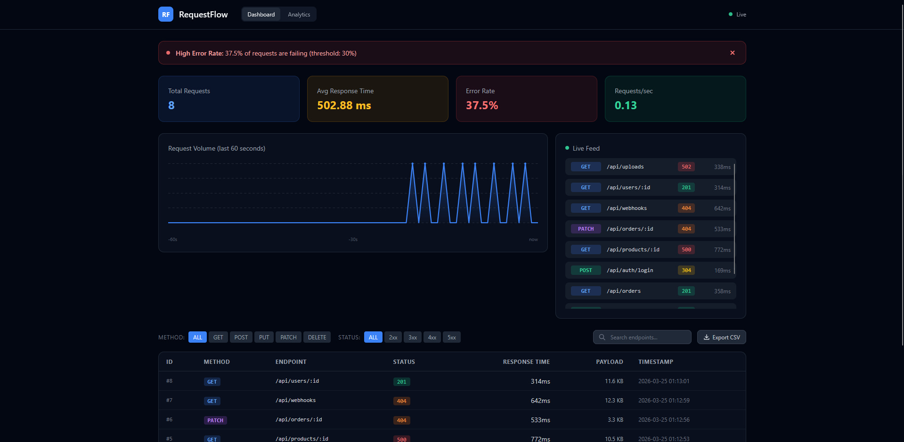

# RequestFlow — API Request Monitoring Dashboard

Real-time dashboard for monitoring API requests: live feed, error alerts, analytics, and CSV export.



---

## What it does

- **Live feed** — incoming API requests appear in real time via SSE (Server-Sent Events)
- **Stats cards** — total requests, average response time, error rate, requests/sec
- **Real-time chart** — request volume over the last 60 seconds
- **Error alerts** — automatic banner when error rate exceeds 30%
- **Filtering** — by HTTP method (GET, POST, PUT, DELETE, PATCH) and status class (2xx, 3xx, 4xx, 5xx)
- **Endpoint search** — live search across the requests table
- **CSV export** — download filtered results with one click
- **Analytics page** — slowest endpoints, error distribution, method breakdown

---

## Tech stack

| Layer    | Technology                        |
|----------|-----------------------------------|
| Frontend | React + Vite + Recharts           |
| Backend  | Node.js + Express                 |
| Database | SQLite via sql.js (WebAssembly)   |
| Realtime | SSE (Server-Sent Events)          |

---

## Architecture decisions

**SSE instead of WebSockets** — data flows only server → client, so SSE is sufficient. Simpler setup, no extra dependencies, auto-reconnects built in.

**sql.js instead of better-sqlite3** — no native compilation required (no Python/C++ toolchain). Works out of the box on any machine.

**Server-side simulator** — fake requests are generated on the backend (every 2–3 seconds) and broadcast to all connected clients. Keeps data generation co-located with the database.

**Indexed queries** — indexes on `created_at`, `status_code`, and `method` keep dashboard queries fast even as the table grows.

---

## Getting started

### Prerequisites
- Node.js 18+
- npm

### Install

```bash
git clone https://github.com/floraaa331/requestflow.git
cd requestflow
npm run install:all
```

### Run

```bash
npm run dev
```

- Frontend: http://localhost:5173  
- Backend API: http://localhost:3001

---

## API endpoints

| Method | Endpoint         | Description                          |
|--------|------------------|--------------------------------------|
| GET    | /api/requests    | Paginated list with filters          |
| GET    | /api/stats       | Dashboard stats (total, RPS, errors) |
| GET    | /api/timeline    | Request volume per second (last 60s) |
| GET    | /api/recent      | Most recent N requests               |
| GET    | /api/analytics   | Slowest endpoints, error/method stats|
| GET    | /api/stream      | SSE stream for real-time updates     |

---

## Project structure

```
requestflow/
├── server/
│   ├── index.js       # Express server, SSE broadcast, REST routes
│   ├── database.js    # SQLite layer — schema, queries, persistence
│   └── simulator.js   # Fake request generator
└── client/
    └── src/
        ├── App.jsx
        ├── pages/
        │   ├── Dashboard.jsx
        │   └── Analytics.jsx
        └── components/
```

---

## License

MIT
